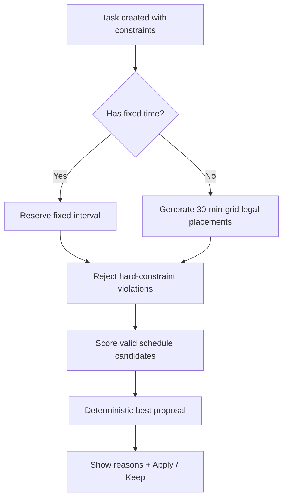
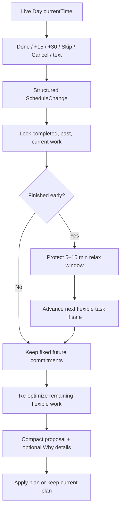

# Replan — Shortcut Challenge Submission Notes

## 1. Problem and approach

A normal calendar records a plan but does not repair it. Replan focuses on the moment when the original day stops being valid: a task runs long, finishes early, is cancelled, or a flexible task still has no time assigned.

I narrowed the MVP to one complete workflow: **construct a feasible day, then adapt the remaining day when reality changes**. This intentionally prioritizes depth over feature count. Fixed commitments, deadlines, availability windows, optional work, and priority all feed the same scheduling model rather than being implemented as separate special cases.

The key architectural decision is to keep the scheduler independent from React. UI actions are converted into structured inputs, then the pure TypeScript engine performs all constraint checking, search, scoring, replanning, and explanation. This means the same engine can later be reused by a mobile client.

## 2. Technical decisions and reasoning

### Hard constraints vs soft preferences

I separated validity from preference. An overlap, moved fixed event, strict deadline miss, or availability-window violation makes a schedule invalid. These are never hidden inside a numeric score. Only valid schedules are ranked.

Soft scoring uses five explicit terms: priority delay, deadline pressure, idle gaps, optional-unscheduled cost, and disruption. Their default weights live in one configuration file. This makes behavior explainable and testable instead of relying on scattered magic numbers.

### Candidate generation and search

Normal flexible-task candidates are generated on a 30-minute grid. I added one deliberate Live Day exception for early completion: the user chooses a 5–15-minute relax window, shown as a separate countdown, and the already-next flexible task may be moved to the exact minute that relax window ends if every hard constraint still holds. For example, finishing at 13:27 with a 10-minute relax window can propose the next flexible task at 13:37. The broader search remains on the 30-minute grid.

Tasks are searched in deterministic constraint order: mandatory work first, then earlier deadlines, narrower windows, higher priorities, and longer durations. The engine uses bounded backtracking rather than “first free gap.” That lets it reconsider combinations when an early placement blocks a more constrained task later. A search-node limit is explicit; if hit, the engine reports that the returned plan is the best feasible plan found within that budget.

### Replanning and disruption

Replanning does not shift the entire timeline. Past/completed/current work is locked and fixed future commitments stay fixed. After an early finish, Replan first protects the selected short relax window and attempts to advance the already-next flexible task so released time becomes useful rather than merely becoming idle time. Remaining flexible tasks are then optimized again. The old schedule is still supplied to the scoring function so unnecessary movement elsewhere carries a disruption penalty.

### Time injection and simulation

The scheduler never calls the system clock to decide “now.” `currentTime` is an explicit input. The frontend can therefore inject real time or an accelerated simulation timestamp into exactly the same scheduler. Simulation mode has Play/Pause, 5 min / 10 min / 30 min per second, Next event, and Reset controls. This made Live Day behavior demoable and deterministic without writing a fake scheduling path.

### Structured text updates

The MVP includes a deliberately small text parser for phrases such as “finished early,” “need +30m,” “skip,” and “cancel.” It only maps text into `ScheduleChange` objects. It cannot invent a new schedule. The deterministic engine remains responsible for all scheduling decisions.

## 3. Verification

The core behavior is covered with deterministic tests for:

- simple feasible scheduling;
- overlapping fixed commitments;
- strict deadline violations;
- availability-window violations;
- impossible mandatory workload;
- preferred-time placement;
- no valid preferred-time placement;
- overrun replanning;
- early completion with 5–15-minute relax window behavior;
- advancing the next flexible task immediately after the relax window;
- shortening the relax window when a fixed commitment is too close;
- cancellation;
- preserving past work;
- deterministic repeated inputs;
- 13:27 → 13:30 grid snapping;
- simulation clock behavior;
- structured update parsing.

I also included a framework-independent `verify:core` smoke test that compiles the scheduler and runs assertions without needing React or Next.js. The purpose is not to claim the app is flawless, but to make the most important logic easy to verify independently from the UI.

## 4. Flowcharts

### Plan / Find a Time



### Live Day replanning



## 5. Architecture and stack

```text
Next.js / React UI
        |
        v
interaction adapters
        |
        v
pure TypeScript scheduler
  | constraints
  | candidates
  | urgency
  | scoring
  | search
  | replan
  | explanation / diff
        |
        v
localStorage persistence
```

Stack: Next.js, React, TypeScript strict mode, Vitest, ESLint, localStorage. No backend, database, authentication, maps, or LLM scheduling was added because none strengthens the core challenge workflow enough to justify the complexity.

## 6. AI use and ownership

AI was used for scaffolding, drafting test cases, suggesting code organization, and accelerating UI implementation. I kept the important product decisions explicit: domain model, hard/soft constraint split, score terms, search approach, time injection, replanning locks, and scope limits.

The checks I would perform before release are: run the full test/build/lint suite in a clean environment, stress-test larger daily task sets near the search budget, test daylight-saving/timezone transitions, add edit-task UX, and observe real users to see whether explanations are sufficient to maintain trust.

## 7. Deliberate non-goals

I did not build recurring events, multi-day study preparation, sleep or contextual recovery rules beyond the simple post-task relax window, travel/traffic, weather, top-K alternative schedules, mobile apps, or a backend. Those are plausible future extensions, but adding them to this challenge version would weaken the main thing I want to demonstrate: a small scheduling engine whose behavior I can explain and verify.
